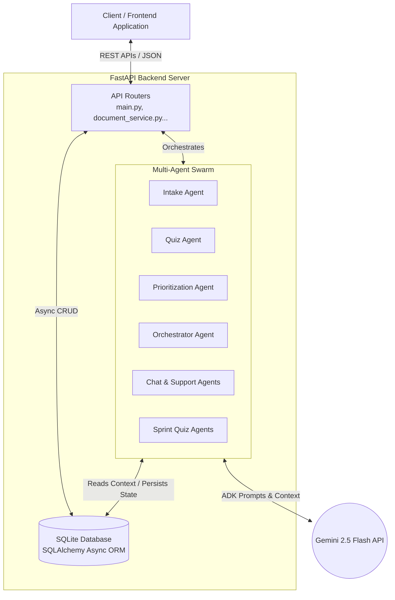
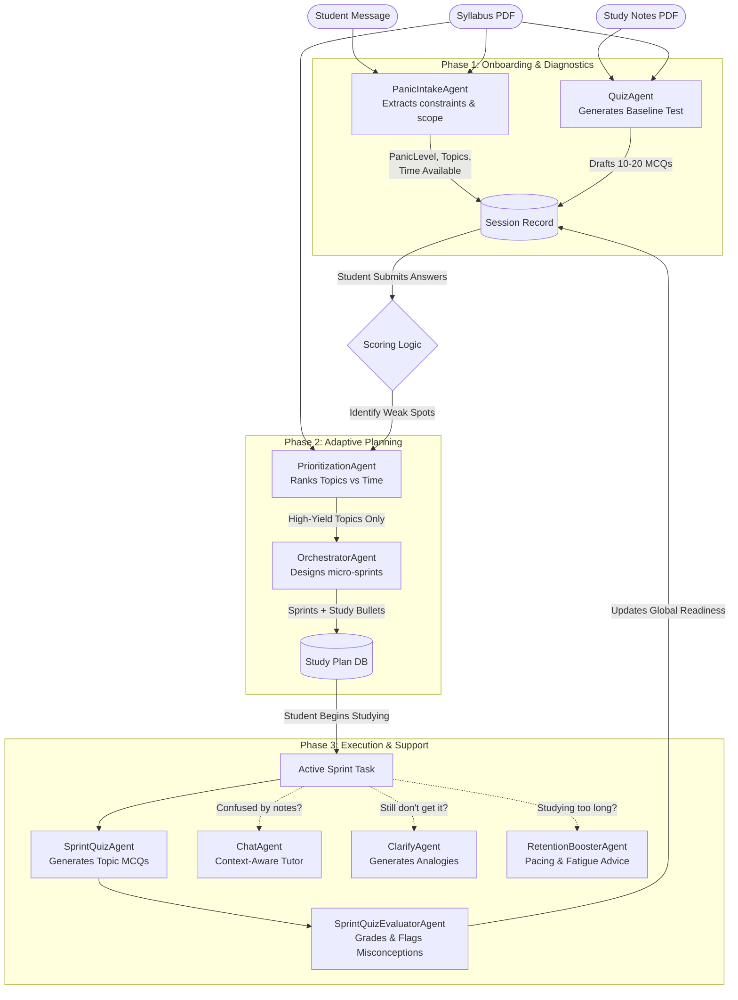

# Cramming Crisis Coordinator — Architecture Overview

This document provides a highly detailed breakdown of the backend architecture and the internal flow of the AI agent "swarm." The system is built using FastAPI, SQLite/SQLAlchemy, and Google ADK (Agent Development Kit) powered by Gemini 2.5 Flash.

---

## 🏗️ 1. Complete Backend Architecture

The application is structured into a classic 3-tier REST architecture, but the "business logic" layer is heavily augmented with asynchronous LLM pipelines.

### High-Level System Diagram

### Key Architectural Layers

1. **Routing Layer ([main.py](file:///c:/Users/Sai%20charan/Desktop/BL_hackthon/Bayeslabs-Hackathon/backend/main.py), [document_service.py](file:///c:/Users/Sai%20charan/Desktop/BL_hackthon/Bayeslabs-Hackathon/backend/document_service.py), etc.)**:
   - Handles incoming HTTP requests and validates payloads using Pydantic models.
   - Coordinates file uploads (PDF extraction) and manages endpoint security/CORS.
   
2. **Database Layer ([database.py](file:///c:/Users/Sai%20charan/Desktop/BL_hackthon/Bayeslabs-Hackathon/backend/database.py), [models.py](file:///c:/Users/Sai%20charan/Desktop/BL_hackthon/Bayeslabs-Hackathon/backend/models.py))**:
   - Uses `aiosqlite` for asynchronous, non-blocking database queries.
   - Strictly normalizes data into tables: `session_records`, [documents](file:///c:/Users/Sai%20charan/Desktop/BL_hackthon/Bayeslabs-Hackathon/backend/document_service.py#113-132), `study_plans`, `sprint_sessions`, `quiz_questions`, and attempt logs.
   
3. **Agent Layer (`agents/*.py`)**:
   - Acts as the core cognitive engine. Data is passed from the database to highly specialized Python objects wrapping Google ADK [Agent](file:///c:/Users/Sai%20charan/Desktop/BL_hackthon/Bayeslabs-Hackathon/backend/agents/chat_agent.py#43-115) instances.
   
4. **Environment Constraints**:
   - Everything is stateless at the API level. Per-session state (like the ChatAgent's conversation history) is tied to a unique `session_id` stored in the database or ADK `InMemoryRunner`.

---

## 🤖 2. The Multi-Agent Swarm Architecture

Instead of relying on a single, massive prompt, the system breaks the studying lifecycle into targeted micro-tasks handled by **8 specialized agents**. This prevents prompt hallucination and allows for modular scaling.

### Agent Swarm Data Flow & Interactions

### Detailed Agent Roles

#### Group A: The Intake & Diagnostic Layer
These agents run the moment a student hits `POST /start`.
*   **PanicIntakeAgent** ([panic_intake.py](file:///c:/Users/Sai%20charan/Desktop/BL_hackthon/Bayeslabs-Hackathon/backend/agents/panic_intake.py)): The listener. It reads the student's erratic text ("I know nothing about arrays!!") plus the syllabus to extract a highly structured JSON: [PanicState](file:///c:/Users/Sai%20charan/Desktop/BL_hackthon/Bayeslabs-Hackathon/backend/agents/schemas.py#13-20) (panic level 1-10, available hours, urgency reason).
*   **QuizAgent** ([quiz_agent.py](file:///c:/Users/Sai%20charan/Desktop/BL_hackthon/Bayeslabs-Hackathon/backend/agents/quiz_agent.py)): The diagnostician. It reads the uploaded study notes and generates a targeted multiple-choice exam to establish a baseline of what the student *actually* knows, versus what they *think* they know.

#### Group B: The Strategy & Planning Layer
Triggered upon `POST /quiz/submit` (after the student finishes the baseline test).
*   **PrioritizationAgent** ([prioritization.py](file:///c:/Users/Sai%20charan/Desktop/BL_hackthon/Bayeslabs-Hackathon/backend/agents/prioritization.py)): The ruthless time manager. It cross-references the topics the student failed on the quiz with the total time remaining. It drops low-yield topics if time is scarce (e.g., < 4 hours).
*   **OrchestratorAgent** ([orchestrator.py](file:///c:/Users/Sai%20charan/Desktop/BL_hackthon/Bayeslabs-Hackathon/backend/agents/orchestrator.py)): The curriculum designer. It converts the prioritized topics into 10-25 minute "Micro-Sprints." Crucially, it drafts the specific **study content bullet points** the student must review during that sprint.

#### Group C: The Execution & Verification Layer
Triggered as the student works through their plan.
*   **SprintQuizAgent** ([sprint_quiz_agent.py](file:///c:/Users/Sai%20charan/Desktop/BL_hackthon/Bayeslabs-Hackathon/backend/agents/sprint_quiz_agent.py)): The topic verifier. After finishing a Sprint, it generates an MCQ exam based *only* on that Sprint's specific study content. The correct answers/explanations are generated but hidden in the DB.
*   **SprintQuizEvaluatorAgent** ([sprint_quiz_evaluator.py](file:///c:/Users/Sai%20charan/Desktop/BL_hackthon/Bayeslabs-Hackathon/backend/agents/sprint_quiz_evaluator.py)): The grader. Once the student submits the Sprint Quiz, it analyzes *why* they chose incorrect answers, generating personalized misconception feedback and deciding if they are `ready_for_exam`.

#### Group D: The Real-Time Tutoring Layer
Triggered on demand while studying.
*   **ChatAgent** ([chat_agent.py](file:///c:/Users/Sai%20charan/Desktop/BL_hackthon/Bayeslabs-Hackathon/backend/agents/chat_agent.py)): The conversational tutor. Powered by an ADK `InMemoryRunner` to maintain conversation history. On the first message, it is primed with the entire database context (quiz scores, panic state, notes, syllabus) so it can relate answers specifically back to the student's exact exam parameters.
*   **ClarifyAgent** ([clarify.py](file:///c:/Users/Sai%20charan/Desktop/BL_hackthon/Bayeslabs-Hackathon/backend/agents/clarify.py)): The simplifier. When hit via `/clarify`, it takes a difficult concept and breaks it down using an analogy (e.g. comparing Backpropagation to a water pipe system).
*   **RetentionBoosterAgent** ([retention.py](file:///c:/Users/Sai%20charan/Desktop/BL_hackthon/Bayeslabs-Hackathon/backend/agents/retention.py)): The pace monitor. Hit via `/session/feedback`, it tracks study duration and signals breaks or encouragement to prevent fatigue.
